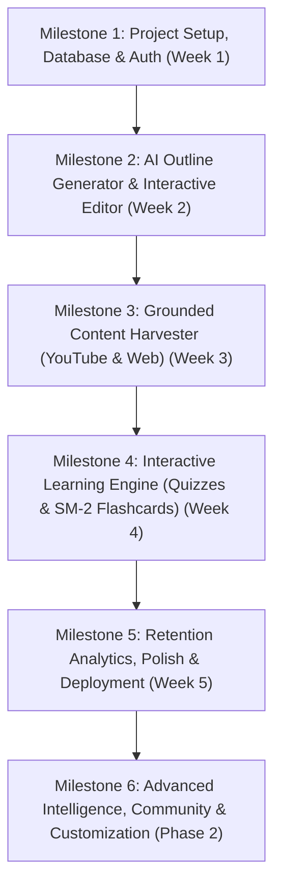

# LearnStratum - AI-Generated Autonomous LMS
> Zero-Cost, Intelligent, Curriculum-First Learning Platform

---

## 1. Project Vision & Core Idea

**LearnStratum** is an intelligent, self-curating Learning Management System (LMS) designed for autodidacts and learners who want structured paths without paywalls. 

Instead of pre-recorded proprietary content, LearnStratum dynamically synthesizes entire courses from open web and video ecosystems:
1. **Goal & Cadence Input:** The user provides a target topic, daily/weekly time commitment, and baseline experience level.
2. **AI Curriculum Synthesis:** Gemini produces an interactive, structured course syllabus (modules, lessons, objectives, search keywords).
3. **Interactive Syllabus Customization:** The user reviews, reorders, adjusts depth, or deletes topics.
4. **Grounding & Content Harvesting (Anti-Hallucination Pipeline):** YouTube Data API v3 and Jina Reader / Tavily search engines discover verified, high-quality videos and documentation for every lesson node.
5. **Interactive Mastery Engine:** Automatically generated quizzes with step-by-step reasoning and active-recall flashcards powered by the **SM-2 Spaced Repetition Algorithm**.
6. **Progress & Retention Analytics:** Real-time visibility into study streaks, retention probability, and syllabus completion.

---

## 2. Zero-Cost Tech Stack Architecture

Every technology chosen below operates within a permanent, generous free tier:

| Layer | Selected Tech | Free Tier Allocation & Role |
| :--- | :--- | :--- |
| **Framework** | **Next.js 16 (App Router, React 19, TS)** | High-performance server components, server actions, and API routes. |
| **UI & Styling** | **Tailwind CSS v4 + shadcn/ui** | Accessible, modular, and developer-friendly UI component library. |
| **Database & Auth** | **Supabase (PostgreSQL)** | Free tier: 500MB DB, 50,000 monthly active users, Row-Level Security (RLS). |
| **ORM** | **Prisma / Drizzle ORM** | Type-safe migrations, typed queries, and schema generation. |
| **AI Intelligence** | **Google Gemini 2.0 / 1.5 Flash** | Via Google AI Studio: Free tier provides 15 RPM, 1M TPM, 1,500 RPD with native JSON Schema output. |
| **Video Discovery** | **YouTube Data API v3** | 10,000 quota units/day on Google Cloud Console (100 search calls/day, cached in Postgres). |
| **Web Content Reader** | **Jina Reader API (`r.jina.ai`)** | 100% free open engine to transform any documentation/article URL into clean Markdown. |
| **Search Engine API** | **Tavily AI / DuckDuckGo** | Tavily offers 1,000 free searches/month tailored for AI retrieval pipelines. |
| **Icons & Visuals** | **Lucide React** | Lightweight SVG icons for the interface. |
| **Deployment** | **Vercel** | Free Hobby tier for Next.js continuous deployment, edge functions, and SSL. |

---

## 3. High-Level System Architecture Flow

```
[User Input: Topic, Level, Time Budget]
                  │
                  ▼
         [Next.js Server Action]
                  │
                  ▼
   [Gemini API (Structured Outputs / JSON)]
                  │
                  ▼
     [Interactive Syllabus Editor] ◄── User tweaks, adds, reorders modules
                  │
                  ▼
           [Confirm Course]
                  │
        ┌─────────┴─────────┐
        ▼                   ▼
 [YouTube Data API]   [Tavily / Jina Reader]
 (Finds top videos)   (Extracts top docs/articles)
        └─────────┬─────────┘
                  │
                  ▼
      [Gemini Flash (Quizzes & Flashcards)]
                  │
                  ▼
        [Supabase PostgreSQL]
                  │
                  ▼
  [Interactive Classroom & Analytics]
```

---

## 4. Database Schema Specification (Supabase PostgreSQL)

```sql
-- Users (managed via Supabase Auth + profile table)
CREATE TABLE profiles (
    id UUID PRIMARY KEY REFERENCES auth.users(id) ON DELETE CASCADE,
    email TEXT,
    display_name TEXT,
    avatar_url TEXT,
    created_at TIMESTAMPTZ DEFAULT NOW(),
    updated_at TIMESTAMPTZ DEFAULT NOW()
);

-- Auto-provision profile trigger
CREATE OR REPLACE FUNCTION public.handle_new_user()
RETURNS TRIGGER AS $$
BEGIN
  INSERT INTO public.profiles (id, email, display_name)
  VALUES (new.id, new.email, COALESCE(new.raw_user_meta_data->>'full_name', split_part(new.email, '@', 1)))
  ON CONFLICT (id) DO UPDATE SET email = EXCLUDED.email;
  RETURN NEW;
END;
$$ LANGUAGE plpgsql SECURITY DEFINER;

CREATE OR REPLACE TRIGGER on_auth_user_created
  AFTER INSERT ON auth.users
  FOR EACH ROW EXECUTE PROCEDURE public.handle_new_user();

-- Courses
CREATE TABLE courses (
    id UUID PRIMARY KEY DEFAULT gen_random_uuid(),
    user_id UUID REFERENCES profiles(id) ON DELETE CASCADE,
    title TEXT NOT NULL,
    description TEXT,
    topic TEXT NOT NULL,
    difficulty_level TEXT NOT NULL CHECK (difficulty_level IN ('beginner', 'intermediate', 'advanced')),
    weekly_hours_allocated INT NOT NULL,
    status TEXT NOT NULL DEFAULT 'draft' CHECK (status IN ('draft', 'generating', 'active', 'completed')),
    created_at TIMESTAMPTZ DEFAULT NOW(),
    updated_at TIMESTAMPTZ DEFAULT NOW()
);

-- Modules (Course Units)
CREATE TABLE modules (
    id UUID PRIMARY KEY DEFAULT gen_random_uuid(),
    course_id UUID REFERENCES courses(id) ON DELETE CASCADE,
    title TEXT NOT NULL,
    order_index INT NOT NULL,
    estimated_minutes INT DEFAULT 60,
    created_at TIMESTAMPTZ DEFAULT NOW()
);

-- Lessons (Within Modules)
CREATE TABLE lessons (
    id UUID PRIMARY KEY DEFAULT gen_random_uuid(),
    module_id UUID REFERENCES modules(id) ON DELETE CASCADE,
    title TEXT NOT NULL,
    order_index INT NOT NULL,
    objectives JSONB DEFAULT '[]'::jsonb,
    search_queries JSONB DEFAULT '[]'::jsonb,
    is_completed BOOLEAN DEFAULT FALSE,
    completed_at TIMESTAMPTZ,
    created_at TIMESTAMPTZ DEFAULT NOW()
);

-- Curated Resources (Videos & Articles)
CREATE TABLE resources (
    id UUID PRIMARY KEY DEFAULT gen_random_uuid(),
    lesson_id UUID REFERENCES lessons(id) ON DELETE CASCADE,
    type TEXT NOT NULL CHECK (type IN ('youtube_video', 'web_article', 'doc_page')),
    title TEXT NOT NULL,
    url TEXT NOT NULL,
    external_id TEXT, -- e.g., YouTube video ID
    channel_or_author TEXT,
    duration_seconds INT,
    summary_markdown TEXT,
    is_completed BOOLEAN DEFAULT FALSE,
    created_at TIMESTAMPTZ DEFAULT NOW()
);

-- YouTube Search Quota Cache
CREATE TABLE youtube_search_cache (
    query_hash TEXT PRIMARY KEY,
    query_text TEXT NOT NULL,
    results JSONB NOT NULL,
    cached_at TIMESTAMPTZ DEFAULT NOW()
);

-- Flashcards (SM-2 Spaced Repetition)
CREATE TABLE flashcards (
    id UUID PRIMARY KEY DEFAULT gen_random_uuid(),
    lesson_id UUID REFERENCES lessons(id) ON DELETE CASCADE,
    user_id UUID REFERENCES profiles(id) ON DELETE CASCADE,
    front TEXT NOT NULL,
    back TEXT NOT NULL,
    repetitions INT DEFAULT 0,
    interval_days INT DEFAULT 1,
    ease_factor FLOAT DEFAULT 2.5,
    next_review_at TIMESTAMPTZ DEFAULT NOW(),
    last_reviewed_at TIMESTAMPTZ,
    created_at TIMESTAMPTZ DEFAULT NOW()
);

-- Quizzes & Questions
CREATE TABLE quizzes (
    id UUID PRIMARY KEY DEFAULT gen_random_uuid(),
    lesson_id UUID REFERENCES lessons(id) ON DELETE CASCADE,
    title TEXT NOT NULL,
    created_at TIMESTAMPTZ DEFAULT NOW()
);

CREATE TABLE quiz_questions (
    id UUID PRIMARY KEY DEFAULT gen_random_uuid(),
    quiz_id UUID REFERENCES quizzes(id) ON DELETE CASCADE,
    question TEXT NOT NULL,
    options JSONB NOT NULL, -- Array of strings e.g. ["A", "B", "C", "D"]
    correct_option_index INT NOT NULL,
    explanation TEXT NOT NULL,
    created_at TIMESTAMPTZ DEFAULT NOW()
);

-- Quiz Submissions
CREATE TABLE quiz_submissions (
    id UUID PRIMARY KEY DEFAULT gen_random_uuid(),
    quiz_id UUID REFERENCES quizzes(id) ON DELETE CASCADE,
    user_id UUID REFERENCES profiles(id) ON DELETE CASCADE,
    score FLOAT NOT NULL,
    answers JSONB NOT NULL,
    completed_at TIMESTAMPTZ DEFAULT NOW()
);

-- Daily Study Activity Log (Streak & Retention Analytics)
CREATE TABLE study_activity_logs (
    id UUID PRIMARY KEY DEFAULT gen_random_uuid(),
    user_id UUID REFERENCES profiles(id) ON DELETE CASCADE,
    activity_date DATE NOT NULL DEFAULT CURRENT_DATE,
    activity_type TEXT NOT NULL CHECK (activity_type IN ('lesson_completed', 'quiz_completed', 'flashcard_reviewed')),
    metadata JSONB DEFAULT '{}'::jsonb,
    created_at TIMESTAMPTZ DEFAULT NOW()
);

```

---

## 5. Milestone-Based Implementation Plan



### Milestone 1: Project Setup, Database & Auth (Week 1)
- [x] Initialize Next.js project with TypeScript, Tailwind CSS, App Router.
- [x] Install essential libraries: `lucide-react`, `zod`, `@supabase/ssr`, `@supabase/supabase-js`, `clsx`, `tailwind-merge`.
- [x] Configure Supabase migration script with database schema, automatic user profile trigger, and Row Level Security (RLS) policies.
- [x] Implement Auth flow (Login, Sign-Up, GitHub/Google OAuth server actions, Auth callback route handler, Middleware session updater).
- [x] Create persistent dashboard shell with navigation, metric overview, and user profile state.

### Milestone 2: AI Outline Generation & Interactive Editor (Week 2)
- [x] Integrate `@google/genai` (Gemini 2.5 Flash SDK) with structured JSON schemas using Zod.
- [x] Build Course Creation Wizard (`/courses/new`):
  - Topic input, Difficulty selector (`Beginner`, `Intermediate`, `Advanced`), Weekly hours allocated slider.
- [x] Implement Server Action to prompt Gemini to generate a tailored curriculum matching the student's available hours.
- [x] Build the **Interactive Syllabus Editor**:
  - Reorder buttons for modules and lessons.
  - Inline editing of lesson titles, module titles, and course metadata.
  - "Add Module", "Add Lesson", "Delete Lesson", "Delete Module" controls.
  - "Confirm & Build Course" action persisting course, modules, and lessons into Supabase.

### Milestone 3: Grounded Content Harvester (YouTube & Web) (Week 3)
- [x] Setup YouTube Data API v3 client with quota conservation logic:
  - Cache identical query results in PostgreSQL `youtube_search_cache`.
  - Query parameters: `type=video`, `videoDuration=medium`, `relevanceLanguage=en`.
- [x] Integrate Tavily AI Search & Jina Reader (`https://r.jina.ai/<target_url>`) for web documentation extraction.
- [x] Build automated resource curation runner that populates `resources` table for each lesson on-demand.
- [x] Build the **Classroom View (`/courses/[id]/lesson/[lessonId]`)**:
  - Embedded YouTube Player with clean controls and multi-video selector.
  - Clean markdown reader view for summarized documentation and web articles.
  - Interactive lesson completion checklist & streak activity logging.

### Milestone 4: Interactive Learning Engine (Quizzes & SM-2 Flashcards) (Week 4)
- [x] Implement automated Quiz Generator:
  - Prompt Gemini with lesson objectives to create 3–5 multi-choice questions with answer rationale.
- [x] Build Quiz Interface:
  - Instant answer validation, detailed explanation popup, score tracking.
- [x] Implement automated Flashcard Generator:
  - 5 high-yield conceptual flashcards per lesson.
- [x] Build Spaced Repetition (SM-2 Algorithm) Study Deck:
  - Rate recall quality (0 to 5).
  - Update `interval_days`, `repetitions`, `ease_factor`, and `next_review_at`.
  - Filter cards due for review on the current day.

### Milestone 5: Retention Analytics, Polish & Deployment (Week 5)
- [x] Student Performance Dashboard:
  - Daily/weekly study streak calendar.
  - Overall course syllabus completion percentage.
  - Flashcard retention curve and quiz score history.
- [x] Graceful error handling & API rate limit throttling (`@upstash/ratelimit` free tier).
- [x] Deploy production build to **Vercel** with custom environment variables.
- [x] Smoke tests, verification, and end-to-end user testing.

### Milestone 6: Advanced Intelligence, Community & Customization (Phase 2)

#### Feature 1: Context-Aware AI Sidekick / Tutor in Classroom
- [x] Add collapsible AI Tutor drawer to the Classroom view (`/courses/[id]/lesson/[lessonId]`)
- [x] Feed current lesson title, objectives, and harvested markdown as Gemini context window
- [x] Quick-action buttons: "Explain differently", "Real-world analogy", "Quiz me on this section"
- [x] Streaming response display with typing effect
- [x] Rate limit tutor requests (5 queries/minute per user)

#### Feature 2: Verifiable Certificates of Completion
- [ ] Extend DB schema: add `certificates` table (id, user_id, course_id, issued_at, verification_hash)
- [ ] Auto-generate certificate when course reaches 100% lesson completion AND all quizzes attempted
- [ ] Generate verifiable PDF/SVG certificate with user name, course title, completion date, SHA-256 hash
- [ ] Public verification page (`/verify/[hash]`) for third-party validation
- [ ] "Add to LinkedIn" share button with pre-filled URL

#### Feature 3: Semantic Vector Search (Supabase pgvector)
- [ ] Enable `pgvector` extension in Supabase SQL Editor
- [ ] Add `embedding vector(768)` column to `lessons` and `resources` tables
- [ ] Generate embeddings via Gemini embedding model when lesson/resource is saved
- [ ] Build `/search` page with semantic query input
- [ ] Display matched lessons and resources with relevance score

#### Feature 4: Dark / Light Theme Toggle (next-themes)
- [ ] Install `next-themes` package
- [ ] Wrap `RootLayout` in `ThemeProvider` with `attribute="class"` and `defaultTheme="system"`
- [ ] Add `ThemeToggle` button component to `Navbar` (sun/moon icon toggle)
- [ ] Support `System`, `Light`, and `Dark` modes

#### Feature 5: Public Course Sharing & Forking
- [ ] Add `is_public` boolean column and `slug` (unique, URL-safe) column to `courses` table
- [ ] Public course gallery page (`/explore`) listing all public courses
- [ ] Public course detail view (`/explore/[slug]`) accessible without login
- [ ] "Fork to My Dashboard" button that deep-copies course + modules + lessons to the logged-in user's account
- [ ] Toggle visibility control on course settings page

---

## 6. Spaced Repetition Logic (SM-2 Reference)

When reviewing flashcards, calculate the next review interval using the standard SuperMemo-2 algorithm:

```typescript
export interface SM2Input {
  repetition: number;   // previous repetitions count
  interval: number;     // previous interval in days
  easeFactor: number;   // default 2.5
  grade: number;        // user score from 0 (blackout) to 5 (perfect recall)
}

export interface SM2Output {
  repetition: number;
  interval: number;
  easeFactor: number;
  nextReviewDate: Date;
}

export function calculateSM2({ repetition, interval, easeFactor, grade }: SM2Input): SM2Output {
  let nextRepetition = repetition;
  let nextInterval = interval;
  let nextEaseFactor = easeFactor;

  if (grade >= 3) {
    if (repetition === 0) {
      nextInterval = 1;
    } else if (repetition === 1) {
      nextInterval = 6;
    } else {
      nextInterval = Math.round(interval * easeFactor);
    }
    nextRepetition += 1;
  } else {
    nextRepetition = 0;
    nextInterval = 1;
  }

  // Adjust ease factor (minimum limit 1.3)
  nextEaseFactor = Math.max(
    1.3,
    easeFactor + (0.1 - (5 - grade) * (0.08 + (5 - grade) * 0.02))
  );

  const nextReviewDate = new Date();
  nextReviewDate.setDate(nextReviewDate.getDate() + nextInterval);

  return {
    repetition: nextRepetition,
    interval: nextInterval,
    easeFactor: Number(nextEaseFactor.toFixed(2)),
    nextReviewDate,
  };
}
```

---

## 7. Immediate Next Steps (Starting Milestone 1)
1. Install initial project dependencies (Supabase, Zod, Lucide icons).
2. Configure `.env.example` with Supabase, Gemini, and YouTube API credentials.
3. Configure the Supabase client (`src/lib/supabase/client.ts` and `server.ts`).
4. Build the core layout with dark/light mode and dashboard navigation.
