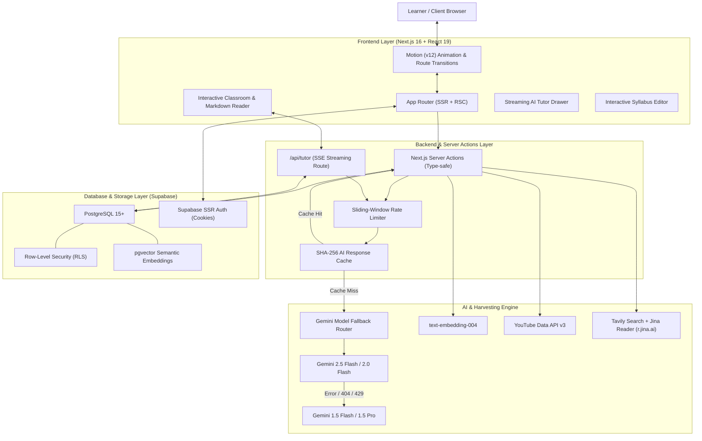
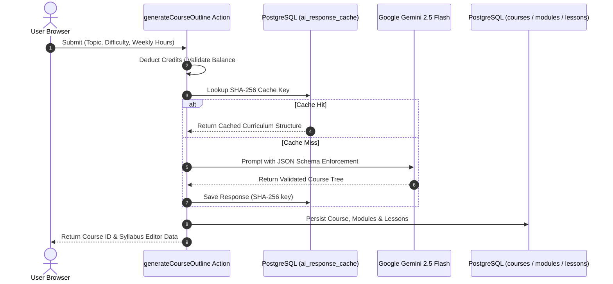
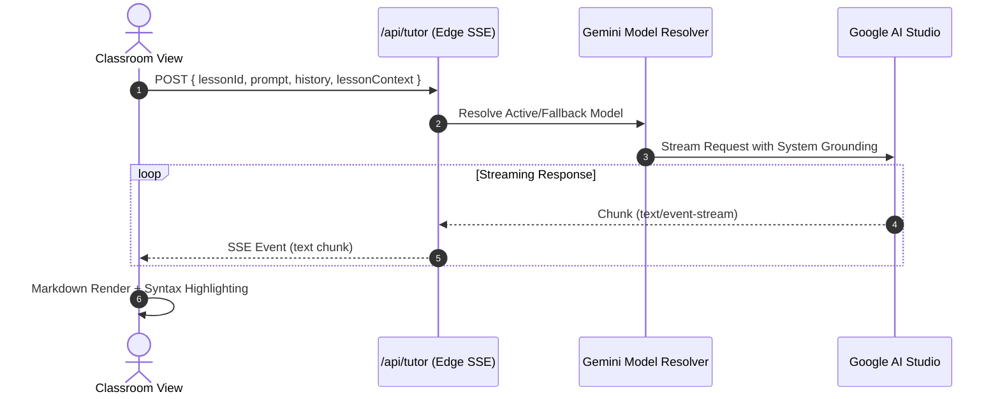

# LearnStratum System Architecture

This document provides a comprehensive overview of the LearnStratum architectural design, data flows, integration layers, and reliability mechanisms.

---

## 1. High-Level Architecture Overview

LearnStratum is built on a modern, decoupled web architecture designed to deliver sub-second page transitions, robust multi-modal content harvesting, zero-hallucination pedagogical materials, and AI generation resilience at zero infrastructure cost.

---

## 2. Core Architectural Pillars

### 2.1 Next.js 16 App Router & React 19
- **Server Components by Default:** Page routes fetch course data, gamification state, credits, and public feed directly on the server via `createClient()` with cookie-based SSR Supabase clients.
- **Client Components where Interactive:** Interactive components (Syllabus Editor, YouTube Player, Markdown Reader, Quiz Panel, 3D Flashcard Deck, AI Tutor Drawer, Credits Modal) are isolated client boundaries marked with `'use client'`.
- **Dynamic Route Transitions:** Implemented via `src/app/template.tsx` with `motion/react`, ensuring fresh route re-mounts and uniform fluid slide/fade navigation across all pages without layout flickers.

### 2.2 Google Gemini Model Auto-Fallback Engine
LLM models frequently evolve, deprecate versions, or hit localized rate limits. LearnStratum incorporates a multi-tier resilient fallback architecture in `src/lib/gemini/models.ts`:

1. **Candidate Models Hierarchy:**
   - Primary: `gemini-2.5-flash`
   - Secondary: `gemini-2.0-flash`
   - Fallback 1: `gemini-1.5-flash`
   - Fallback 2: `gemini-1.5-pro`
2. **Model Resolver Algorithm:**
   - Detects HTTP 404 (Model Not Found) or 429 / Quota Exceeded.
   - Automatically re-attempts the prompt against the next available model in the candidate tier without breaking the user session or failing the lesson synthesis.

### 2.3 Grounded Content Harvester (Zero Hallucinations)
Instead of allowing LLMs to hallucinate video links or out-of-date technical documentation:
1. **Curriculum Synthesis:** Gemini produces an abstract pedagogical topic tree with targeted search queries.
2. **YouTube Video Harvest:** The server queries YouTube Data API v3 for high-relevance video lectures from reputable channels. Query results are hashed with SHA-256 and cached in PostgreSQL (`lesson_resources`).
3. **Documentation Harvester:** 
   - Uses Tavily AI Search to discover authoritative documentation URLs (e.g., official docs, MDN, RFCs).
   - Routes the URL through Jina Reader (`https://r.jina.ai/{url}`) to retrieve stripped, clean Markdown, eliminating ads, popups, and navigation cruft.

### 2.4 Spaced Repetition Engine (SuperMemo-2 / SM-2)
LearnStratum implements the cognitive science-backed SuperMemo-2 spaced repetition algorithm (`src/lib/sm2.ts`):
- Tracks $EF$ (Ease Factor), $I$ (Interval in days), and $n$ (Repetition count).
- Grade scale:
  - `0`: Complete Blackout
  - `1`: Incorrect; Familiar upon seeing answer
  - `2`: Incorrect; Easy to recall after seeing answer
  - `3`: Correct with significant difficulty
  - `4`: Correct with slight hesitation
  - `5`: Perfect, instant recall
- Updates next review timestamp with PostgreSQL indexing to power the daily review queue on the learner dashboard.

### 2.5 Vector Embeddings & pgvector Semantic Search
- Lessons and curated documentation are converted into 768-dimensional dense vector embeddings using Google's `text-embedding-004` model.
- Embeddings are indexed with IVFFlat / HNSW indexes in PostgreSQL using the `pgvector` extension.
- The `/search` route performs cosine similarity matching via custom PostgreSQL RPC functions (`match_lessons` and `match_resources`).

### 2.6 AI Response Caching & Rate Limiting
- **SHA-256 Content Caching:** Every generated syllabus, quiz, and flashcard deck is fingerprinted. Identical requests hit `ai_response_cache`, returning instant results with 0 credit deduction and zero API calls.
- **Sliding-Window Rate Limiter:** Protects AI synthesis endpoints using Upstash Redis when configured, with an automatic in-memory sliding-window fallback (`src/lib/ratelimit.ts`).

---

## 3. Data Flow Diagrams

### 3.1 Course Synthesis & Grounding Flow

### 3.2 In-Lesson AI Tutor Streaming Flow

---

## 4. Security & Isolation Model

1. **Row-Level Security (RLS):** Every user-facing table in Supabase is governed by granular RLS policies. Users can only read, insert, update, or delete records where `user_id = auth.uid()`, with exceptions for public exploration (`is_public = true`) and certificate verification (`/verify/[hash]`).
2. **Service Role Segregation:** Client-side interactions always use the anonymous key (`NEXT_PUBLIC_SUPABASE_ANON_KEY`). Privileged operations (credit adjustments, background cache pruning) operate through the server-only `SUPABASE_SERVICE_ROLE_KEY`.
3. **Ad-Free Video Embedding:** Videos are served strictly through YouTube's privacy-enhanced domain (`youtube-nocookie.com`), stripping tracking cookies and promotional overlays.
4. **Ad-Free Clean Documentation:** Documentation extracted through Jina Reader sanitizes malicious script tags, tracking pixels, and CSS stylesheets, presenting safe Markdown in an isolated viewer.
