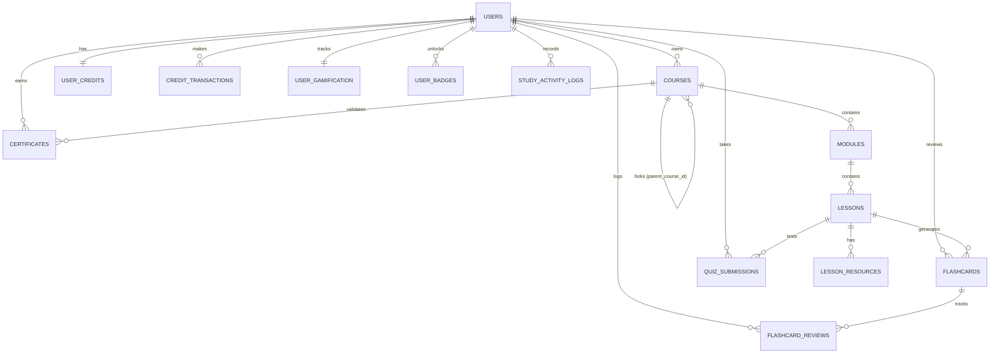

# LearnStratum Database Schema & Migrations

LearnStratum uses **Supabase (PostgreSQL 15+)** with Row-Level Security (RLS), custom triggers, and the `pgvector` extension for semantic search.

---

## 1. Entity-Relationship (ER) Diagram



---

## 2. Table Definitions

### 2.1 `courses`
Stores the high-level course meta-information, status, and public visibility.

| Column | Type | Constraints / Default | Description |
|---|---|---|---|
| `id` | `UUID` | Primary Key, `gen_random_uuid()` | Unique course identifier |
| `user_id` | `UUID` | Foreign Key `auth.users(id)`, NOT NULL | Owner / creator of course |
| `title` | `TEXT` | NOT NULL | Course title |
| `description` | `TEXT` | NULLABLE | Pedagogical overview |
| `topic` | `TEXT` | NOT NULL | Original prompt topic |
| `difficulty_level` | `TEXT` | NOT NULL, Check: `beginner`, `intermediate`, `advanced` | Experience tier |
| `weekly_hours_allocated` | `INTEGER` | NOT NULL, Default: `5` | Weekly time budget |
| `status` | `TEXT` | NOT NULL, Default: `draft`, Check: `draft`, `active`, `completed`, `archived` | Lifecycle status |
| `is_public` | `BOOLEAN` | NOT NULL, Default: `false` | Whether visible in Explore feed |
| `slug` | `TEXT` | UNIQUE, NULLABLE | URL slug for public exploration |
| `parent_course_id` | `UUID` | Foreign Key `courses(id)`, NULLABLE | Set if cloned / forked |
| `fork_count` | `INTEGER` | NOT NULL, Default: `0` | Number of times forked |
| `created_at` | `TIMESTAMPTZ` | Default: `now()` | Creation timestamp |
| `updated_at` | `TIMESTAMPTZ` | Default: `now()` | Last modification timestamp |

---

### 2.2 `modules`
Logical grouping of curriculum milestones within a course.

| Column | Type | Constraints / Default | Description |
|---|---|---|---|
| `id` | `UUID` | Primary Key, `gen_random_uuid()` | Unique module identifier |
| `course_id` | `UUID` | Foreign Key `courses(id)` ON DELETE CASCADE | Associated course |
| `title` | `TEXT` | NOT NULL | Module title |
| `description` | `TEXT` | NULLABLE | Module summary |
| `order_index` | `INTEGER` | NOT NULL | Sequence index in syllabus |
| `created_at` | `TIMESTAMPTZ` | Default: `now()` | Creation timestamp |

---

### 2.3 `lessons`
Individual learning nodes within a module.

| Column | Type | Constraints / Default | Description |
|---|---|---|---|
| `id` | `UUID` | Primary Key, `gen_random_uuid()` | Unique lesson identifier |
| `module_id` | `UUID` | Foreign Key `modules(id)` ON DELETE CASCADE | Associated module |
| `title` | `TEXT` | NOT NULL | Lesson title |
| `objectives` | `TEXT[]` | NOT NULL, Default: `{}` | Key concept objectives |
| `search_keywords` | `TEXT[]` | NOT NULL, Default: `{}` | Keywords used for YouTube/web search |
| `order_index` | `INTEGER` | NOT NULL | Sequence index in module |
| `is_completed` | `BOOLEAN` | NOT NULL, Default: `false` | Completion checkbox state |
| `completed_at` | `TIMESTAMPTZ` | NULLABLE | Completion timestamp |
| `embedding` | `vector(768)` | NULLABLE | Vector embedding for semantic search |
| `created_at` | `TIMESTAMPTZ` | Default: `now()` | Creation timestamp |

---

### 2.4 `lesson_resources`
Grounded multi-modal materials harvested for a lesson.

| Column | Type | Constraints / Default | Description |
|---|---|---|---|
| `id` | `UUID` | Primary Key, `gen_random_uuid()` | Resource identifier |
| `lesson_id` | `UUID` | Foreign Key `lessons(id)` ON DELETE CASCADE | Associated lesson |
| `type` | `TEXT` | NOT NULL, Check: `youtube_video`, `web_doc`, `interactive` | Resource modality |
| `title` | `TEXT` | NOT NULL | Resource headline |
| `url` | `TEXT` | NOT NULL | Target URL or video embed URL |
| `content` | `TEXT` | NULLABLE | Extracted Markdown or transcript |
| `metadata` | `JSONB` | Default: `'{}'::jsonb` | Video ID, channel, thumbnail, duration |
| `embedding` | `vector(768)` | NULLABLE | Vector embedding for semantic search |
| `created_at` | `TIMESTAMPTZ` | Default: `now()` | Harvest timestamp |

---

### 2.5 `flashcards` & `flashcard_reviews`
Spaced repetition data powering the SuperMemo-2 cognitive engine.

#### `flashcards`
| Column | Type | Constraints / Default | Description |
|---|---|---|---|
| `id` | `UUID` | Primary Key, `gen_random_uuid()` | Flashcard identifier |
| `user_id` | `UUID` | Foreign Key `auth.users(id)` ON DELETE CASCADE | Card owner |
| `lesson_id` | `UUID` | Foreign Key `lessons(id)` ON DELETE CASCADE | Parent lesson |
| `front` | `TEXT` | NOT NULL | Question / Prompt |
| `back` | `TEXT` | NOT NULL | Answer / Explanation |
| `ease_factor` | `NUMERIC(4,2)` | Default: `2.50` | SuperMemo-2 Ease Factor |
| `interval_days` | `INTEGER` | Default: `0` | SuperMemo-2 interval days |
| `repetitions` | `INTEGER` | Default: `0` | Consecutive successful reviews |
| `next_review_at` | `TIMESTAMPTZ` | Default: `now()` | Scheduled review timestamp |
| `created_at` | `TIMESTAMPTZ` | Default: `now()` | Card creation timestamp |

#### `flashcard_reviews`
| Column | Type | Constraints / Default | Description |
|---|---|---|---|
| `id` | `UUID` | Primary Key, `gen_random_uuid()` | Review log identifier |
| `flashcard_id` | `UUID` | Foreign Key `flashcards(id)` ON DELETE CASCADE | Reviewed card |
| `user_id` | `UUID` | Foreign Key `auth.users(id)` ON DELETE CASCADE | User |
| `grade` | `INTEGER` | Check: `0 <= grade <= 5` | Recall quality grade (0–5) |
| `reviewed_at` | `TIMESTAMPTZ` | Default: `now()` | Review timestamp |

---

### 2.6 `quiz_submissions`
Tracks knowledge checks and scoring.

| Column | Type | Constraints / Default | Description |
|---|---|---|---|
| `id` | `UUID` | Primary Key, `gen_random_uuid()` | Submission identifier |
| `user_id` | `UUID` | Foreign Key `auth.users(id)` ON DELETE CASCADE | Student identifier |
| `lesson_id` | `UUID` | Foreign Key `lessons(id)` ON DELETE CASCADE | Lesson tested |
| `total_questions` | `INTEGER` | NOT NULL | Question count |
| `correct_answers` | `INTEGER` | NOT NULL | Correct question count |
| `score_percentage` | `NUMERIC(5,2)` | NOT NULL | Calculated score % |
| `answers_json` | `JSONB` | NOT NULL | User selections and rationales |
| `submitted_at` | `TIMESTAMPTZ` | Default: `now()` | Submission timestamp |

---

### 2.7 `user_gamification` & `user_badges`
Powers the 5 Stratum ranks, habit streaks, and achievement badges.

#### `user_gamification`
| Column | Type | Constraints / Default | Description |
|---|---|---|---|
| `user_id` | `UUID` | Primary Key, Foreign Key `auth.users(id)` | User identifier |
| `total_xp` | `INTEGER` | NOT NULL, Default: `0` | Accumulated Stratum XP |
| `current_streak_days` | `INTEGER` | NOT NULL, Default: `0` | Consecutive study days |
| `last_activity_date` | `DATE` | NULLABLE | Most recent study date |
| `updated_at` | `TIMESTAMPTZ` | Default: `now()` | Last update timestamp |

#### `user_badges`
| Column | Type | Constraints / Default | Description |
|---|---|---|---|
| `id` | `UUID` | Primary Key, `gen_random_uuid()` | Badge identifier |
| `user_id` | `UUID` | Foreign Key `auth.users(id)` ON DELETE CASCADE | User |
| `badge_key` | `TEXT` | NOT NULL | Badge identifier (e.g., `first_lesson`, `quiz_master`) |
| `unlocked_at` | `TIMESTAMPTZ` | Default: `now()` | Unlock timestamp |

---

### 2.8 `user_credits` & `credit_transactions`
Manages AI generation credits and billing audit logs.

#### `user_credits`
| Column | Type | Constraints / Default | Description |
|---|---|---|---|
| `user_id` | `UUID` | Primary Key, Foreign Key `auth.users(id)` | User identifier |
| `balance` | `INTEGER` | NOT NULL, Default: `1000` | Current available credits |
| `plan` | `TEXT` | NOT NULL, Default: `'free'` | Plan level (`free`, `pro`) |
| `updated_at` | `TIMESTAMPTZ` | Default: `now()` | Last update timestamp |

#### `credit_transactions`
| Column | Type | Constraints / Default | Description |
|---|---|---|---|
| `id` | `UUID` | Primary Key, `gen_random_uuid()` | Transaction identifier |
| `user_id` | `UUID` | Foreign Key `auth.users(id)` ON DELETE CASCADE | User |
| `amount` | `INTEGER` | NOT NULL | Credits added (+) or deducted (-) |
| `method` | `TEXT` | Default: `'system'` | Top up method (`bkash`, `nagad`, `rocket`, `system`) |
| `reference` | `TEXT` | NULLABLE | Transaction ID or receipt reference |
| `status` | `TEXT` | Default: `'completed'` | Status (`pending`, `approved`, `completed`, `rejected`) |
| `description` | `TEXT` | NOT NULL | Event description |
| `created_at` | `TIMESTAMPTZ` | Default: `now()` | Transaction timestamp |

---

### 2.9 `ai_response_cache`
Deduplicates identical AI generation calls across all users.

| Column | Type | Constraints / Default | Description |
|---|---|---|---|
| `id` | `UUID` | Primary Key, `gen_random_uuid()` | Cache entry identifier |
| `cache_key` | `TEXT` | UNIQUE, NOT NULL | SHA-256 hash of prompt input |
| `response_json` | `JSONB` | NOT NULL | Serialized LLM response |
| `hit_count` | `INTEGER` | NOT NULL, Default: `1` | Cumulative cache hits |
| `created_at` | `TIMESTAMPTZ` | Default: `now()` | Cache creation timestamp |
| `last_hit_at` | `TIMESTAMPTZ` | Default: `now()` | Most recent hit timestamp |

---

### 2.10 `certificates`
Cryptographically verifiable completion certificates.

| Column | Type | Constraints / Default | Description |
|---|---|---|---|
| `id` | `UUID` | Primary Key, `gen_random_uuid()` | Certificate identifier |
| `user_id` | `UUID` | Foreign Key `auth.users(id)` ON DELETE CASCADE | Recipient |
| `course_id` | `UUID` | Foreign Key `courses(id)` ON DELETE CASCADE | Completed course |
| `verification_hash` | `TEXT` | UNIQUE, NOT NULL | 32-character hexadecimal verification hash |
| `recipient_name` | `TEXT` | NOT NULL | Learner display name |
| `course_title` | `TEXT` | NOT NULL | Course title |
| `issued_at` | `TIMESTAMPTZ` | Default: `now()` | Certificate issue date |

---

## 3. Database Functions & Triggers

### 3.1 New User Setup (`handle_new_user`)
Triggered automatically on `auth.users` insertion:
- Creates a `user_credits` record initialized with **1,000 free starter credits**.
- Creates a `user_gamification` record with 0 XP and 0 streak days.
- Logs a welcome credit transaction in `credit_transactions`.

### 3.2 Semantic Vector Match Functions
```sql
CREATE OR REPLACE FUNCTION match_lessons (
  query_embedding vector(768),
  match_threshold float,
  match_count int
)
RETURNS TABLE (
  id uuid,
  module_id uuid,
  title text,
  similarity float
)
LANGUAGE sql STABLE
AS $$
  SELECT
    lessons.id,
    lessons.module_id,
    lessons.title,
    1 - (lessons.embedding <=> query_embedding) AS similarity
  FROM lessons
  WHERE 1 - (lessons.embedding <=> query_embedding) > match_threshold
  ORDER BY similarity DESC
  LIMIT match_count;
$$;
```

---

## 4. Row-Level Security (RLS) Summary

| Table | SELECT Policy | INSERT / UPDATE / DELETE Policy |
|---|---|---|
| `courses` | Owner (`user_id = auth.uid()`) OR Public (`is_public = true`) | Owner only (`user_id = auth.uid()`) |
| `modules` | Visible if parent course is visible | Owner of parent course only |
| `lessons` | Visible if parent module's course is visible | Owner of parent course only |
| `lesson_resources` | Visible if parent lesson is visible | Owner of parent course only |
| `flashcards` | Owner only (`user_id = auth.uid()`) | Owner only |
| `quiz_submissions` | Owner only (`user_id = auth.uid()`) | Owner only |
| `user_gamification`| Owner only (`user_id = auth.uid()`) | Owner only |
| `user_badges` | Owner only (`user_id = auth.uid()`) | Owner only |
| `user_credits` | Owner only (`user_id = auth.uid()`) | Server action / Service role |
| `certificates` | **Public read** (enables `/verify/[hash]`) | Owner only |
